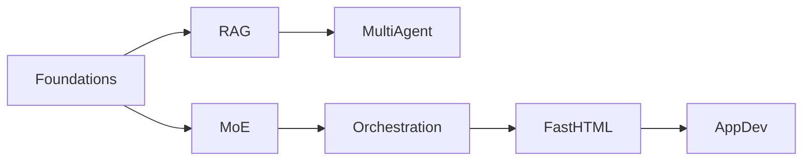
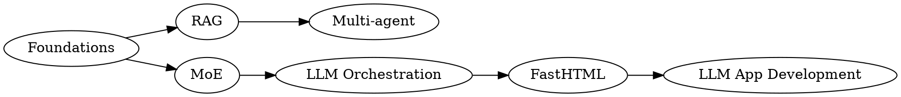

# LLM-Powered Active Learning in the Age of CLI Tools

A modern, reproducible, multi-LLM approach for learning complex technical topics with **nbdev**, **Jupyter Notebooks**, and **LLM CLI tools** (Claude, OpenAI, Gemini, DeepSeek).

This README presents a polished, GitHub‑friendly version of the article—structured, scannable, and ready for open‑source publication.

---

## 🌍 Why This Learning Method Exists

Most technical learning today depends on two linear formats:

* **PDFs** (dense, hard to search)
* **YouTube lectures** (linear, slow to navigate)

Meanwhile, modern AI engineering requires *nonlinear, curiosity-driven exploration*.

**Understanding only matures through output**:

* writing
* explaining
* teaching
* debating

And today's landscape includes a growing ecosystem of **LLM CLI tools**, each with different strengths. No single model is sufficient.

Learning must therefore be:

* interactive
* nonlinear
* multi-LLM
* notebook‑centric
* automated where possible

This leads to a natural solution:

> **nbdev × Multi-LLM CLI = The Learning Operating System for 2025**

---

## ⚠️ A Respectful Note on Solveit

Solveit carries a great vision—"tool‑assisted thinking"—but has practical limits for deep R&D:

| Solveit Strengths    | Solveit Limitations                             |
| -------------------- | ----------------------------------------------- |
| Strong philosophy    | Occasional instability                          |
| Nice editing UI      | Slow responsiveness for programming             |
| Integrated workflow  | Claude dependency → no multi‑LLM workflows      |
| Good for light tasks | Hard to navigate large repositories organically |

Solveit is a great thought tool, but **not a full learning OS**.

nbdev + multi‑LLM CLIs fills that gap.

---

## 🧱 Why nbdev Is the Ideal Learning Substrate

nbdev unifies:

* exploration
* documentation
* testing
* packaging
* publication

**Everything inside a single Notebook.**

### With nbdev you can:

* keep experiments + notes + diagrams + LLM dialogue together
* export only the reusable code as modules
* auto-generate documentation sites
* publish directly to GitHub Pages

> **nbdev turns "learning" into "accumulated software assets."**

---

## 🤖 Why Multi‑LLM CLI Tools Are Essential

Each LLM plays a different role:

| Model        | Strength                                     |
| ------------ | -------------------------------------------- |
| **Claude**   | structure, reasoning, transcript digestion   |
| **OpenAI**   | coding, API design, refactoring              |
| **Gemini**   | huge context windows, multi-source synthesis |
| **DeepSeek** | cost-efficient iterative experimentation     |

Using only one model is like relying on a single professor to teach every subject.

Using many models is like having a team of specialists.

---

## 🌱 Organic Learning: Horizontal + Vertical Mobility

True understanding requires nonlinear jumps:

* **Vertical** → prerequisites, foundations
* **Horizontal** → similar concepts, adjacent tech
* **Cyclical** → abstract ↔ concrete loops

nbdev + LLM CLIs support this natural pattern:

* notebooks allow branching thought
* LLMs answer questions instantly
* code runs beside explanations
* graphs, tests, and text coexist

This is the opposite of passive reading or video watching.

---

## 🧘 The Three Virtues of Programmers (as Learning Principles)

Larry Wall’s virtues map perfectly to this workflow:

* **Laziness** → automate everything (summaries, extraction, publication)
* **Impatience** → minimize friction (multi‑LLM, instant iteration)
* **Hubris** → produce elegant, teachable outputs (nbdev docs)

Your learning becomes:

* automated
* fast
* output‑driven

---

## 🗺️ Visualizing Knowledge: Dependency Graphs With Graphviz

Below is an equivalent **Mermaid** version (GitHub-native rendering):

LLMs can extract prerequisite graphs from lecture transcripts:

This produces a **personal learning map**, not a generic syllabus.

---

## 🔧 Complete Workflow: nbdev × Multi‑LLM Active Learning

A concise, actionable workflow.

### **1. Create an nbdev repository**

Establish the notebook as the central learning workspace.

### **2. Collect transcripts and key materials**

(PDF → text, YouTube → transcript)

### **3. Generate detailed Table of Contents with LLMs**

Build an outline of the entire knowledge space.

### **4. Extract only the topics you care about**

Interest‑driven learning is more efficient.

### **5. Generate dependency graphs → visualize with Graphviz**

Map the optimal learning path.

### **5a. Start from nodes with no prerequisites**

Always learn from the *roots*.

### **6. Deepen understanding via back-and-forth LLM dialogue inside the Notebook**

A Socratic loop.

### **7. Run small code experiments and inline tests**

Learning becomes embodied.

### **8. Export reusable logic via `nbdev_export`**

Only the distilled knowledge becomes library code.

### **9. Auto‑generate documentation and publish via GitHub Pages**

Your learning becomes a public artifact.

### **10. Auto-generate social media summaries (X/LinkedIn/TikTok/etc.)**

Share and refine ideas through community feedback.

### **11. Request ongoing LLM reviews—continuously**

Not just at the end.

---

## 🎯 Why This Method Works

This learning OS delivers:

* **faster understanding** (multi‑LLM reasoning)
* **deeper retention** (output-driven learning)
* **scalable knowledge assets** (nbdev)
* **nonlinear exploration** (organic learning)
* **public visibility & collaboration** (auto docs + social posts)

You open a notebook, and instantly:

* multiple expert LLMs stand by
* experiments run inline
* graphs and dependencies update dynamically
* outputs turn into reusable modules
* the entire process is archived and shareable

---

## 📌 Final Thought

Learning should not be passive, lonely, or linear.

With nbdev × Multi‑LLM CLI, learning becomes:

* **organic**
* **efficient**
* **scalable**
* **creative**
* **motivating**

This is what active learning should look like in 2025 and beyond.
