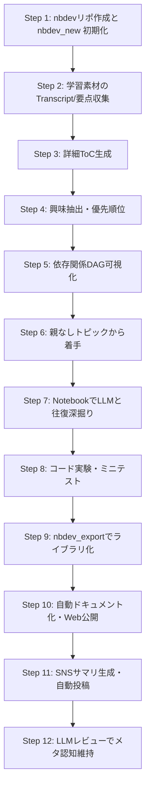

# LLM CLI乱立時代の新・アクティブラーニング論

## はじめに：学びの主役がPDFとYouTubeになった時代に

いま私たちが触れる学習素材の多くは、PDFの論文・スライド、そしてYouTubeの講義動画だ。これは利便性の反面、扱いづらい構造も持っている。動画は**線形**で“検索しにくく”、PDFは読み進めても理解が追いつかないことがある。そして現代の学習者にとって最大の問題は、**興味がない部分は脳に定着しない**という当たり前の事実だ。

しかし同時に、私たちは知っている。**理解はアウトプットによって初めて完成する**ということを。書く、話す、教える、議論する……その過程で曖昧さが浮き彫りになり、思考が研ぎ澄まされる。アウトプットしない限り「理解したつもり」のまま終わってしまうし、記憶にも残らない。そして人に教えることは理解の最終段階であり、同じ興味を持つ人との議論は、しばしばイノベーションの起爆剤にもなる。

こうした背景の中で、現代の学習者を取り巻く状況はさらに複雑化している。理由はシンプルで、**Coding LLM CLIが乱立しているから**だ。Claude、OpenAI、Gemini、DeepSeek……どれも強力だが、それぞれ得意領域が違い、適材適所で使わなければ本来の性能を引き出せない。

だからこそ、私は考える。**学習とは、もはや単独ツールで完結する行為ではない。**
複数のLLMを「学習パートナー」として使い分け、Notebookを中心に水平・垂直に自由移動しながら学ぶことこそが、現代の学習に最適化された姿だ。

その“学習OS”として最も適しているのが、**nbdev × 複数LLM CLI**という組み合わせである。nbdev自体は、実験、確認、関数化、ライブラリ化、文書化、公開を同じjupyter notebook上でシームレスに行うフレームワークです。

## Solveitへの軽い不満と、なぜ私は“別の学習OS”を求めたのか

Solveit は思想として素晴らしい。Jeremy Howard が提案する「思考をツールで支援する」という哲学には深く共感するし、学習と実装を近づけようとする試みも評価に値する。しかし、実際に intensive な学習・研究用途として使おうとすると、いくつかの弱点が浮き上がってくる。

* **動作が不安定で、学習フローが中断されることがある**
* **レスポンスが遅く、プログラミングエディタとしては致命的な場面がある**
* **Claudeへの依存が強く、複数LLMを適材適所で使い分けたい現代の学習スタイルと相性が悪い**
* **リポジトリ全体を横断しながら学習する“オーガニック学習”に向いていない**

Solveit は「軽い思考補助ツール」としては魅力的だが、
**私のように深いR&D、コード実験、長文解析、複数LLMの協業が必要な学習スタイルには適合しなかった。**

そこで私は、Solveit の思想は継承しつつ、制約のない“自分専用の学習OS”として **nbdev × 複数LLM CLI** という構成に辿り着いた。

---

## nbdevが与えてくれる「学びの土壌」

nbdevの強みは、単なるPythonパッケージ生成ツールではなく、**学習・実験・記録・公開の全てがNotebookひとつに統合される点**だ。
Notebookは、思考の揺らぎや試行錯誤、コード例、図、長文メモ、そしてLLMとの対話ログまでも一つのファイルに統合できる。さらに、そのNotebookから直接パッケージ化・ドキュメント化・ブログ公開まで一気通貫で行える。

つまりnbdevは、学びそのものを“資産”へと変換するための土壌なのだ。

ここに複数LLM CLIを組み合わせると、Notebookは一気に**自分専用の有機的学習空間（learning ecosystem）**へと進化する。

---

## 複数LLM CLIがもたらす「専門家チームとしての学習体験」

Claudeは長文解析・構造化が得意。OpenAIはコード生成・API設計が強い。Geminiは巨大コンテキスト処理に秀でる。DeepSeekは圧倒的なコスパで反復実験向き。

このように特性の異なるLLMが並び立つ2025年において、**ひとつのLLMだけで学ぶのは、ひとつの専門分野しか語れない先生に全教科を教わるようなもの**だ。
CLIを使うことで、学習者は状況に応じてLLMを切り替え、複数の視点から学びを掘り下げることができる。いわば自分専用の“専門家チーム”を横に抱えて学習しているような体験になる。

これが、従来の学習方法では到達できない深さと速度を生む。

### tmuxでLLM CLIを水平展開する

複数LLM CLIを実戦投入する際は、tmuxでセッションを張り、それぞれのペイン/ウィンドウに異なるLLM CLI（例：Claude CLI、OpenAI CLI、DeepSeek CLI）を常駐させるのが最もストレスが少ない。

1. `tmux new -s llm-lab` で学習用セッションを開始
2. `Ctrl-b "` や `Ctrl-b %` でペインを分割し、各ペインで `claude ...` / `openai ...` / `deepseek ...` を起動
3. `Ctrl-b w` でウィンドウを移動しながらログを残したまま上下左右に行き来

tmuxを使えば、LLM CLIの出力ログを保持したままNotebookやブラウザへ戻ることができ、複数モデルの回答を並べて比較したり、回答を即座にNotebookへ貼り付けたりといった“水平移動”が圧倒的にスムーズになる。

---

## オーガニック学習：水平・垂直に自由に移動できることの意味

人間の理解は、線形ではない。興味を持った瞬間に深掘りしたいのが自然であり、退屈な箇所をスキップしたいのもまた自然だ。

そして、理解はしばしば上下左右に跳ねる。

* ある概念を理解するために前提へ戻る（垂直移動）
* 似た別概念へジャンプして比較する（水平移動）
* 具体→抽象→具体 と往復する（ダブルループ学習）

この“オーガニック”な動きこそが、学習を高速化し、記憶に定着させ、モチベーションを保ち続ける鍵である。

nbdevと複数LLM CLIは、この自然な学びの構造をそのまま受け止める。
Notebookは非線形に広がり、LLMはいつでも疑問を処理し、コードもテキストも自由に混在できる。これは従来のPDF学習や動画視聴が持つ“線形性”とは対極のアプローチだ。

---

## プログラマの三大美徳と現代アクティブラーニング

Larry Wallが提唱した「プログラマの三大美徳」— **怠惰（Laziness）・短気（Impatience）・傲慢（Hubris）** は、皮肉ではなく、学習においても本質を突く知恵だ。

* **怠惰** → 面倒なことは自動化するべき
* **短気** → 無駄な時間をかけず最短距離で理解したい
* **傲慢** → 自分の理解を正確に示し、他人に教えられる形に保つ

まさにnbdev × LLM CLIの組み合わせは、この三大美徳を体現した学習様式だ。

学習における“怠惰”は自動化となり、“短気”は高速反復となり、“傲慢”はアウトプットとして結晶化する。この3つがそろった時、学習は最大効率に達する。

---

## Step 5：依存関係の可視化（GraphvizによるDAG表示）

ClaudeやGeminiを使えば、学習トピック同士の依存関係をDAG（有向非巡回グラフ）として抽出できる。それをGraphvizで可視化すると、**自分専用の“学習マップ”**が生成される。

例：

```
digraph learning {
  rankdir=LR;
  "基礎LLM" -> "RAG";
  "基礎LLM" -> "MoE";
  "RAG" -> "Multi-agent";
  "MoE" -> "LLM Orchestration";
  "LLM Orchestration" -> "FastHTML";
  "FastHTML" -> "LLMアプリ構築";
}
```

この図は単なる視覚化ではなく、学ぶ順序の最適化そのものであり、迷わず深掘りできる“地図”になる。

---

## nbdev × LLM CLIで行うアクティブラーニング手順まとめ

※ 特に **3 → 4 → 5 のステップは論理的につながっており**、以下の流れで理解が深まるように設計されている：

* **Step 3（詳細ToC生成）**：教材の構造を“外側から”把握し、地図の輪郭を描く段階。
* **Step 4（興味抽出）**：その地図の中から“自分が向かいたい地点”を選ぶ段階。
* **Step 5（依存関係の可視化）**：選んだ目的地に到達するための“最適なルート”を生成する段階。

つまり **3 は地図、4 は目的地選択、5 はルート設計**に相当し、学習プロセス全体をブレずに進める土台になる。

以下は、私が考える2025年版の最適な学習プロセスだ。

1. nbdevリポをGitHubに作成し、`nbdev_new` で初期化してNotebook中心の学習環境を整える。
2. 学習素材（動画TranscriptやPDFなど）のTranscript/要点をLLM/CLIで収集する。
3. Claude/Gemini CLIで詳細ToCを生成し、教材全体の地図を描く。
4. 興味のあるトピックだけを学習対象に絞り（Interest-first Learning）、優先順位を定める。
5. 選んだトピックの依存関係をLLMに抽出させ、GraphvizでDAGとして可視化する。
6. DAGで親を持たないトピックから順に着手し、依存関係を辿りながら学習を進める。
7. Notebook内でLLMとBack & Forthし、完全理解できるまで深掘りする。
8. Notebook内でコード実験・ミニテストを実施し、理解度を検証する。
9. 再利用価値のある内容だけを `nbdev_export` でlibraryノートへ切り出す。
10. nbdevで自動ドキュメント化し、Web公開（Docs/ブログ）まで仕上げる。
11. LLMでSNS向けサマリ（X, LinkedIn, Tiktok, Instagram, YTなど）を生成し、スクリプトで自動投稿する（シェア文化）。
12. 学習途中でも随時LLM（例：Claude CLI output -> Codex CLI）にレビューワークを依頼し、メタ認知を保つ。




---

## おわりに

学習とは、本来もっと自由で、もっと創造的で、もっと個人的な営みだ。線形教材に自分を合わせるのではなく、**自分の興味と速度に合わせて学習空間を動的に生成する**。そのための最適な道具立てこそが、nbdevと複数LLM CLIなのだ。

この方法は、理解を深め、記憶に定着させ、アウトプットを促し、他者との議論を誘発し、結果としてイノベーションを生みやすい環境を整えてくれる。

学びとは、もはや孤独な作業ではない。Notebookをひらけば、そこには専門家チーム（LLM）がいて、興味があればどこへでも飛べる。これこそが2025年以降の“オーガニックで効率的な学習”の姿だ。モチベーションと効率化を最大限に追求した、まさに究極の学習法だ。
